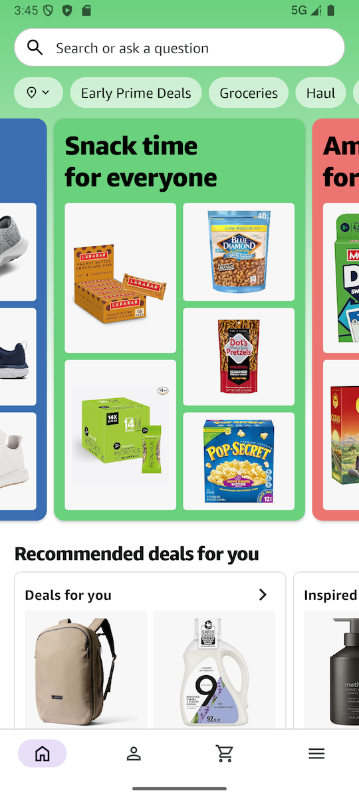
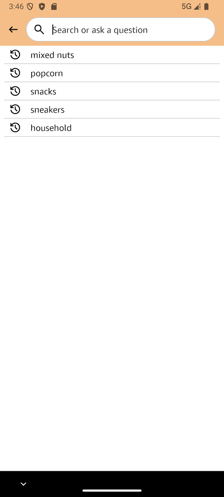
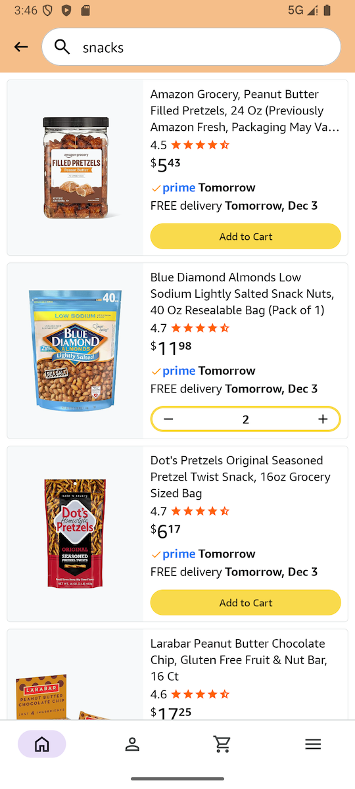
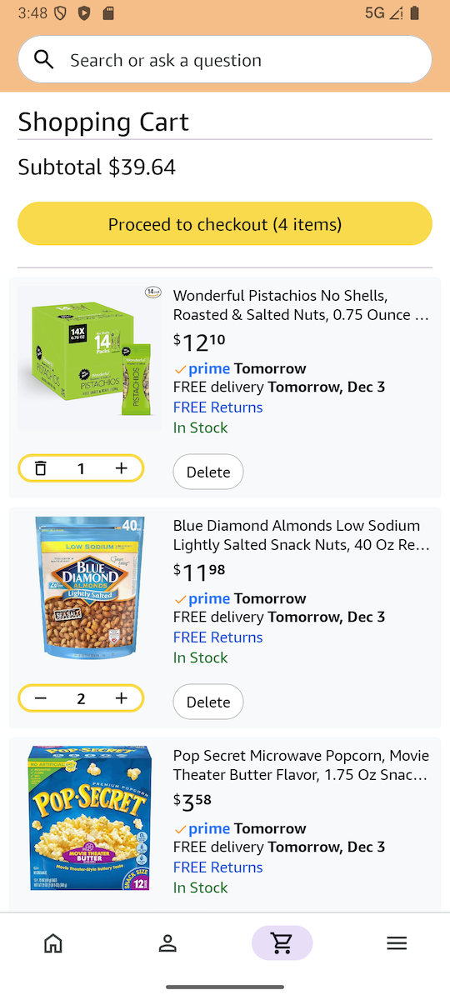
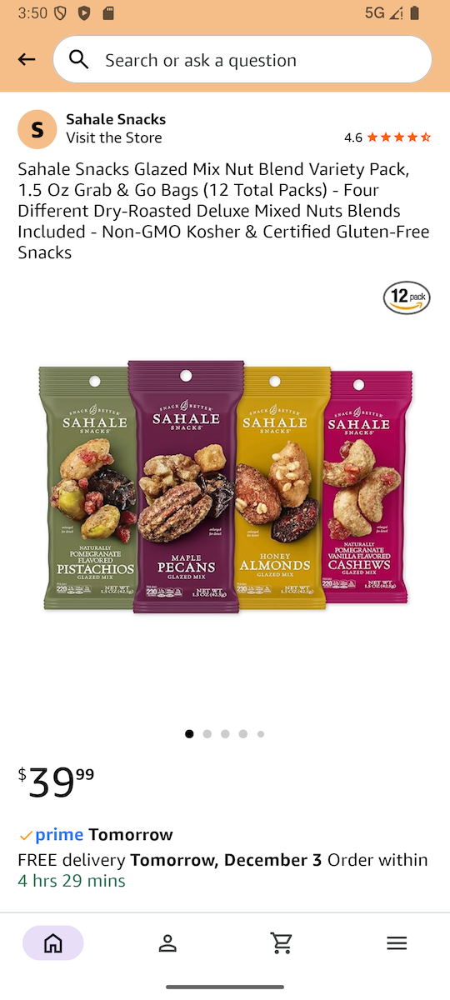
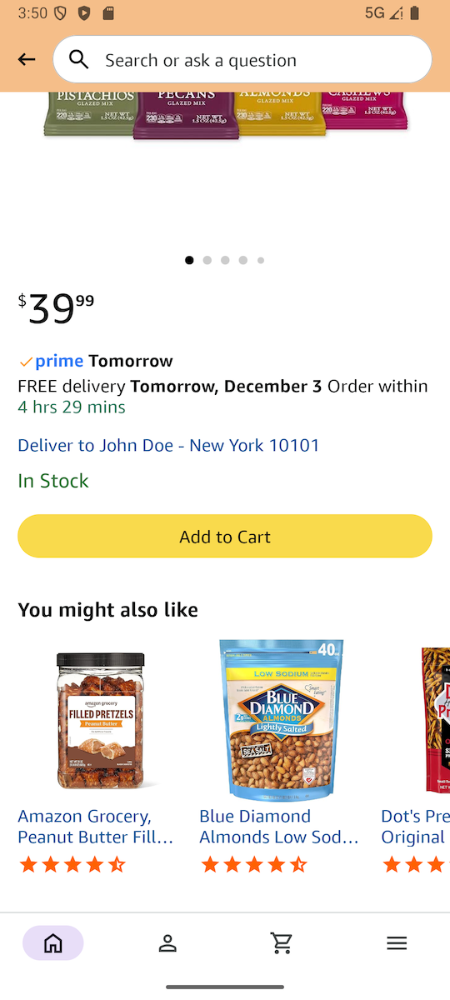

# Mock Amazon Shopping App

## Purpose
The goal of this project is to keep my Android development skills sharp while providing a
practical demonstration. It showcases Compose UI, MVI, multiple ViewModel scopes, concurrency,
animations, navigation, and robust testing.

## Screenshots
  

  
