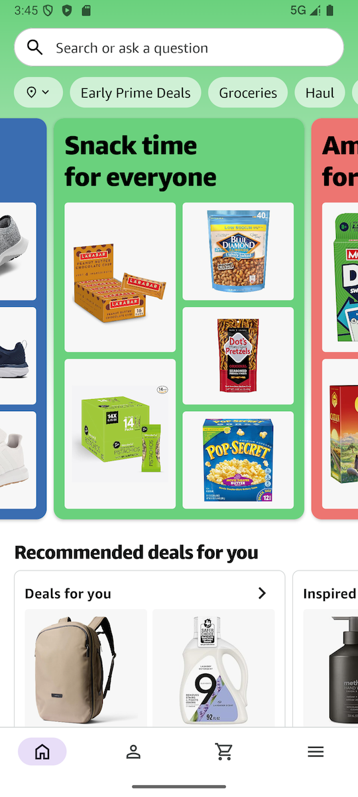
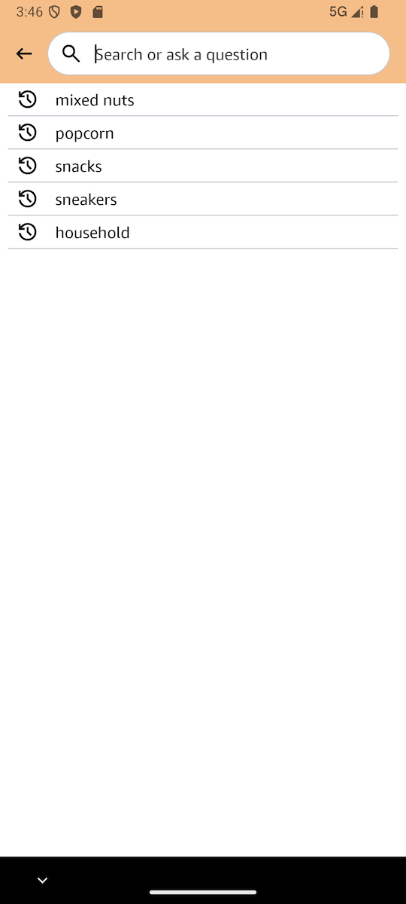
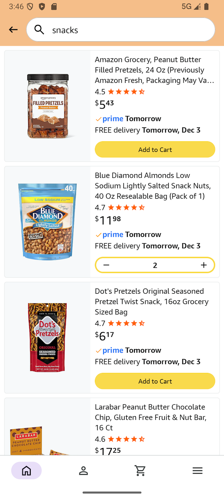
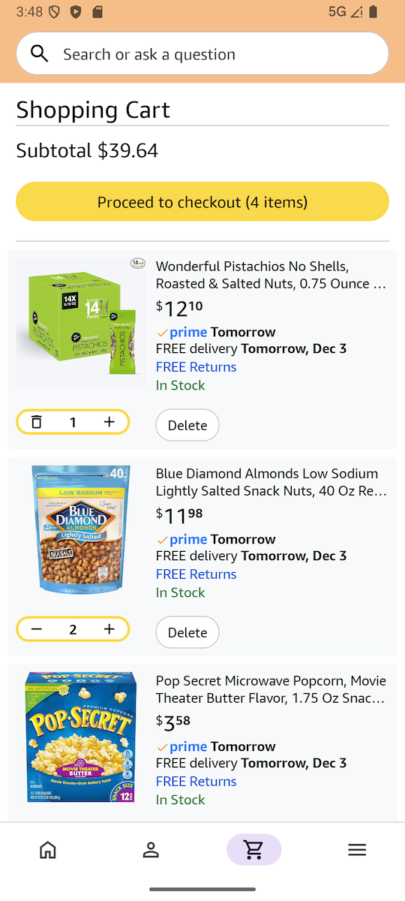
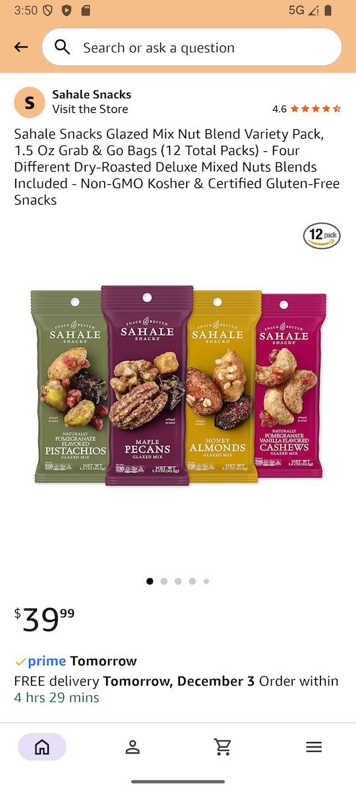
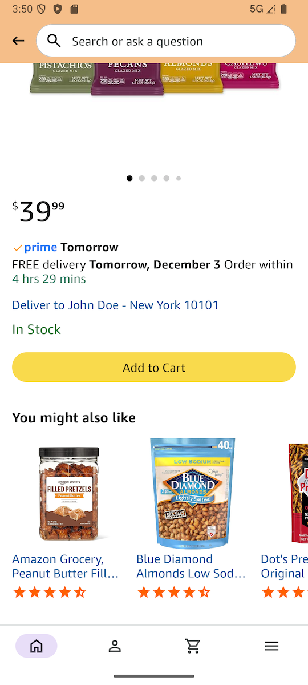

# Mock Amazon App

## Purpose
A fun project to build UIs and explore recently released and alternative Android libs.

New libs so far: Nav3 and OrbitMVI 11.

## Screenshots
  

  


## Setup

### Firebase Analytics
Copy the `google-services.json.template` to `app/google-services.json` file and insert your Firebase credentials.

### Claude CLI

Open the Android Studio terminal and start the Docker container:

```bash
cd claude
docker compose up -d --build
```

Then open an interactive shell via:

```bash
docker exec -it mockamazon-android-claude-cli-1 bash
```

The project root is mounted at `/workspace` inside the container. From there, run `claude` to start a session.
